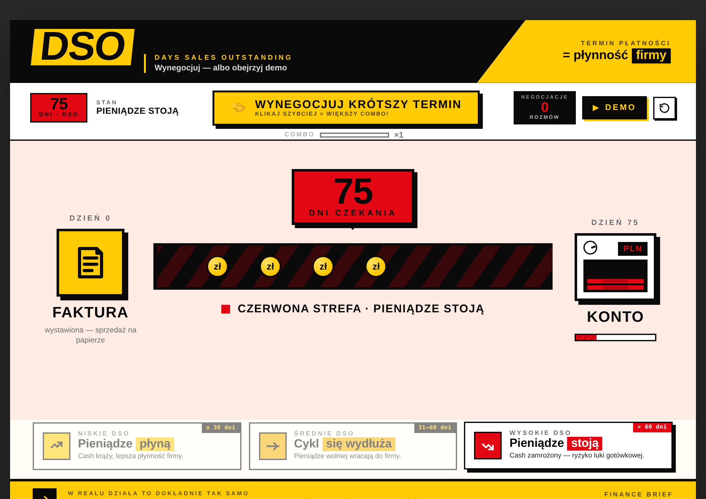
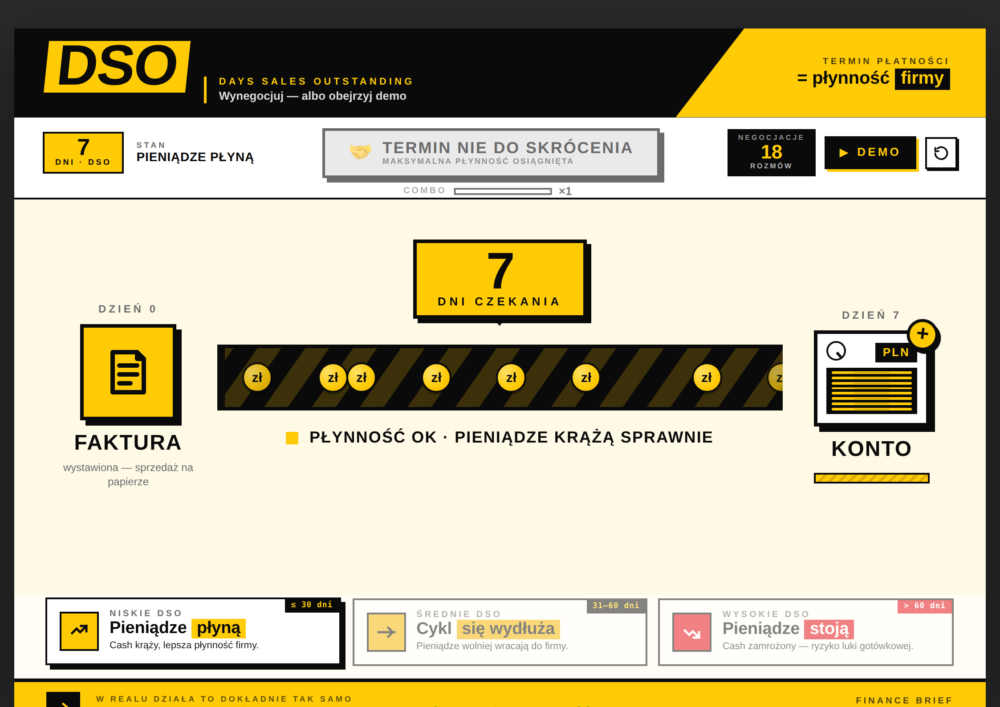

# DSO — Gra o terminach płatności

Interaktywna infografika i mini-gra pokazująca, jak termin płatności (DSO — *Days Sales Outstanding*) wpływa na płynność finansową firmy. Stylistyka korporacyjna Jungheinrich: żółć, czerń, mocna typografia, animowany przepływ pieniądza.

> **[▶ Otwórz grę](https://TWOJ-LOGIN.github.io/NAZWA-REPO/)** ← podmień ten link po wdrożeniu



Cel: zejść z 75 dni do 7 dni i wynegocjować zdrową płynność.



---

## Wdrożenie na GitHub Pages

1. Stwórz nowe repozytorium: <https://github.com/new> (publiczne lub prywatne — Pages działa na obu)
2. **Add file → Upload files** → przeciągnij `index.html`, `README.md` i oba `screenshot-*.png`
3. Commit
4. **Settings → Pages**
5. Source: `Deploy from a branch`, Branch: `main`, folder: `/ (root)` → Save
6. Po ~1 minucie strona jest pod adresem:

   ```
   https://TWOJ-LOGIN.github.io/NAZWA-REPO/
   ```

7. Wklej ten URL gdziekolwiek — Teams, SharePoint, mail, Slack

## Udostępnianie zespołowi

| Kanał | Jak |
|---|---|
| **SharePoint** | Edycja strony → web part **Embed** → wklej URL — gra wyrenderuje się w iframe |
| **Microsoft Teams** | W kanale: zakładka **+ → Website** → wklej URL — koledzy klikają tab i grają |
| **Mail / czat** | Po prostu wyślij link |
| **Prezentacja** | Przed spotkaniem otwórz w pełnym ekranie (F11) zamiast slajdu o DSO |

## Jak grać

- **Klik** na żółty przycisk **WYNEGOCJUJ KRÓTSZY TERMIN** = jedna rozmowa z klientem → DSO spada
- **Klikaj szybciej** — combo (×1 → ×8) rośnie, każde kliknięcie skraca DSO o tyle dni co aktualne combo
- Zwolnij i combo opada; sliding-window 1.5s liczy twoją kadencję
- Jak DSO spadnie do 7 — sejf pełny, monety lecą, achievement **Mistrz Negocjacji**
- **▶ DEMO** w prawym rogu — pokazuje pełen zakres 7→90→7→90 w pętli, bez interakcji
- **↻** — reset, zaczynasz od 75 dni

## Customization

Kilka miejsc w `index.html` które warto zmienić pod swój zespół:

| Co | Gdzie szukać w pliku |
|---|---|
| Stopka *"Finance Brief / Working Capital"* | wyszukaj `Finance Brief` |
| CTA *"W realu działa to dokładnie tak samo"* | wyszukaj `W realu działa` |
| Subtitle *"Wynegocjuj — albo obejrzyj demo"* | wyszukaj `albo obejrzyj demo` |
| Wartość startowa DSO (domyślnie 75) | wyszukaj `startDso: 75` |
| Wartość minimalna (domyślnie 7) | wyszukaj `minDso: 7` |
| Próg "niskie" / "średnie" / "wysokie" DSO | wyszukaj `getZone` |

## Wymagania techniczne

- Pojedynczy plik HTML — wszystkie style i skrypty inline
- Jedyna zewnętrzna zależność: Google Fonts (Barlow Condensed + Manrope) ładowane z CDN
- Działa we wszystkich nowoczesnych przeglądarkach (Chrome, Edge, Firefox, Safari)
- Najlepiej oglądać na desktopie/tablecie — zaprojektowane jako format A4 landscape
- Można wydrukować lub wyeksportować do PDF (Ctrl+P) — animacje zatrzymają się na statycznej klatce

## Licencja / Notka

Tool wewnętrzny, edukacyjny. Stylistyka inspirowana identyfikacją wizualną Jungheinrich do użytku wewnątrz organizacji.
